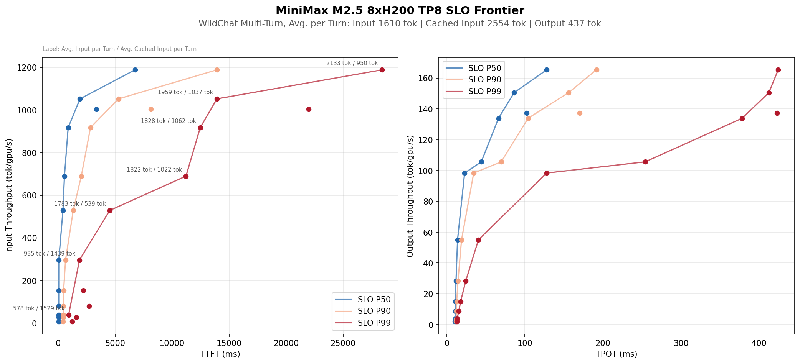

# Multi-Turn Inference Benchmark

Benchmarks LLM serving performance under realistic multi-turn chat workloads. Built on vLLM's multi-turn benchmark with significant design changes.

## Design

### Dataset-Driven Workload

Workloads are defined by an **offline spec** — a JSON file specifying exact session shapes (turn counts, input/output token counts per turn) derived from real conversation data (WildChat). Text content is sampled from a large corpus (Project Gutenberg, ~11M tokens) with wrapping.

```
dataset_analysis/analyze_wildchat.py    → Extracts token statistics from WildChat
dataset_analysis/downsample_wildchat.py → Stratified downsampling preserving distributions
```

### Session Terminology

A **session** is a multi-turn chat conversation. A **turn** is one user-assistant round (1 user message + 1 assistant response). This differs from vLLM's original definition where a "turn" was a single message.

### Balanced Session Dispatch

Sessions are assigned to clients using sort + round-robin to equalize total workload per client:

1. Sort sessions descending by total character count (proxy for tokens)
2. Round-robin assign to clients (heaviest sessions spread evenly)
3. Shuffle within each client (randomize request order, avoid startup burst)

Each client gets its own task queue. This ensures all clients finish around the same time, making **early stop** safe — the benchmark stops when the first client finishes, capturing performance at the target concurrency level without tail skew.

### Concurrency Model

- **1 session per client** (no interleaving) — each client processes one session at a time
- **Open-loop request rate** (Poisson, 0.04 req/s per client) — models realistic user think time
- **Sweep concurrency** by varying number of clients: `(16 32 48 64 96 128 192 256 384 512)`
- Total sessions per sweep point: `max(1000, NC * 0.04 * 600)` — enough for 10 min steady state, minimum 1000 for P99 stability

### Metrics Collection

- **Client-side**: TTFT, TPOT, latency, input/output token counts, prefix cache estimate per request
- **Server-side**: Prometheus scraping every 5s — batch size, queue depth, KV cache usage, prefix cache hits, token throughput, latency breakdown (queue/prefill/decode)
- **Output**: JSON per sweep point with params, summary statistics, raw requests, and prometheus snapshots

### Bug Fixes from vLLM

- **Loop condition**: `while not task_queue_empty or len(active_sessions) > 0` — continues processing active sessions even after task queue is drained
- **Exit condition**: `if len(active_sessions) == 0 and task_queue_empty` — only exits when both conditions are met

## Project Structure

```
multiturn_benchmark/
  bench_serving_multiturn.py   # Main benchmark client
  bench_dataset.py             # Session generation from offline spec
  bench_utils.py               # Logging, colors
  gutenberg_11m.txt            # Text corpus (~11M tokens, 46 Project Gutenberg books)
  wildchat_downsample_15k.json # Default offline spec (15k sessions)

dataset_analysis/
  analyze_wildchat.py          # Extract token stats from WildChat dataset
  downsample_wildchat.py       # Stratified downsampling to create offline specs

visualization/
  plot_slo_throughput.py       # SLO frontier chart (TTFT/TPOT vs throughput)
  plot_prometheus_timeseries.py # Per-run Prometheus dashboard (4 panels)

bmk_minimax-m25.sbatch         # SLURM benchmark launch script
serve_minimax-m25.sbatch       # SLURM server launch script
```

## Usage

```bash
# Launch server
sbatch -t 600 serve_minimax-m25.sbatch

# Launch benchmark sweep (after server is healthy)
SERVER_HOST=<server-node> sbatch -t 600 bmk_minimax-m25.sbatch

# Or run interactively
srun -p h200 --gres=gpu:0 \
    --container-image=vllm/vllm-openai:v0.18.0-cu130 \
    --container-mounts=/mnt/home/kimbo/inferperf-260324:/workspace,/mnt/vast/hf_cache:/mnt/vast/hf_cache \
    --no-container-entrypoint -t 600 --pty bash
# Then: SERVER_HOST=<node> bash bmk_minimax-m25.sbatch
```

## Visualization

```bash
# SLO frontier
uv run --no-project python visualization/plot_slo_throughput.py results/ \
    --spec-file multiturn_benchmark/wildchat_downsample_15k.json \
    --num-gpus 8 --output visualization/slo_frontier.png

# Prometheus dashboard for a single sweep point
uv run --no-project python visualization/plot_prometheus_timeseries.py \
    results/mtbench_minimax-m25_clients128.json
```


